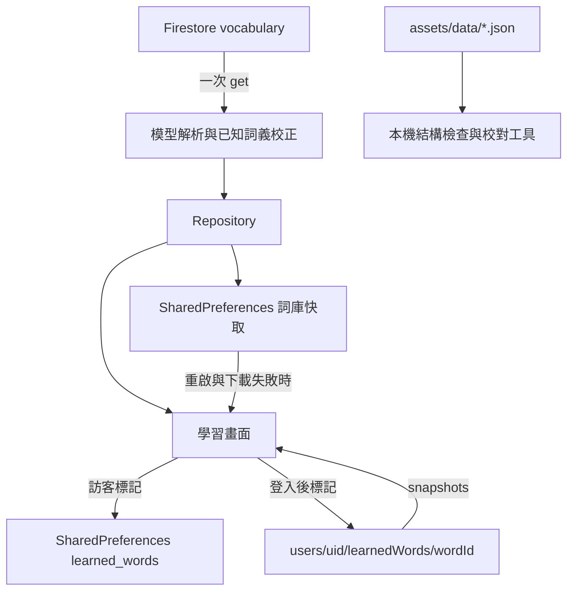

# Gocab 專案與程式碼檢視

檢視日期：2026-10-05。分支：`refactor/architecture-compliance`，HEAD：`ec4e15e`。

## 結論

目前專案是一個學習端 App，已有登入、讀取詞庫、翻卡、已學狀態、篩選、亂序及本機快取，但沒有詞庫管理流程。新增、更新、刪除單字需要另建管理功能；不能只把既有按鈕打開。

你記得的「開 Web、反註解、加入單字」流程，在這份工作目錄及可取得的本機 Git 歷史中沒有找到。我也查了 reflog、已失去分支指向的物件與 IDE 設定。這不能證明它從未存在：未提交且已刪除的程式、其他 checkout、尚未下載的遠端分支，以及外部工具，都不在這次可驗證範圍內。

檢視階段只新增報告，沒有上傳詞庫或執行發佈腳本。後續使用者確認管理端位於另一個已刪除的 Web App repository，因此管理端將另案重建。

## 此分支收尾狀態

使用者授權先完成此分支、發 PR 並合併，Web 管理端延後。本分支包含 UX 與七筆詞義校對，並修復以下檢視發現：

- 訪客已學狀態的讀取／修改／回寫依序執行，避免不同單字互相覆蓋；加入並行新增與新增／移除交錯的回歸測試。
- 詞庫快取寫入失敗仍回傳成功下載的資料；登入進度鏡像失敗不影響即時進度串流。
- 本機 BehaviorSubject 隨 provider 釋放。
- 發佈腳本保留所有既有 archive，遇到同名目標直接停止。

以下章節保留檢視時的重現與原因，這四項已在本分支修復。Android／Web Firebase 設定、啟動降級、穩定閱讀位置、訪客進度合併與管理端仍是後續事項；本分支未更動雲端資料或 Google OAuth 設定。

## 掃描範圍與證據強度

- 檢查 Flutter 啟動、Auth／Vocabulary 的 domain、data、DI、providers、主要 UI、主題、原生玻璃面板、平台設定、腳本、文件與測試。
- 追查本機三個分支、快取的遠端 refs 與 reflog：37 個可達歷史 commit、100 個不同版本的程式來源 blob；另掃描 unreachable commits 的來源及孤立 blob，共 52 個候選 blob。兩組有重疊，不能相加當成不同檔案數。
- 搜尋資產載入、匯入／上傳命名、batch，以及包含 Firestore 的歷史程式寫入操作。歷史 `.set()`／`.delete()`／transaction 寫入均指向 learnedWords，未找到 vocabulary 內容寫入。
- 核對本機實際 Firebase 設定與平台識別碼，只記錄一致性，不輸出憑證內容。
- 本次新增兩個暫存重現測試，使用真實本機資料來源及可控的 repository fake，兩個問題均重現。
- 未實際登入 Google、連線核對正式 Firestore 文件與規則、進行原生裝置測試或完整 Android／iOS 發佈建置。下列平台問題屬程式／設定證據，不宣稱已在裝置上重現。

## 單字資料真正怎麼流動

**assets 並沒有接到 App 的詞庫載入或 Firestore 上傳流程。** `pubspec.yaml` 包含資產，只代表檔案被打包。App 沒有 `rootBundle.loadString` 讀取它們。修改 JSON 不會自動修改雲端資料。

目前雲端單字的識別碼採用 Firestore document ID，覆蓋文件內的 `id` 欄位；本機 JSON 的數字 ID 不能直接視為同一個 ID。已學狀態也依 document ID 儲存，因此匯入工具若每次產生新 document ID，會切斷原有進度關聯。

前一輪的七筆校對在模型解析時，對符合「已知原詞義與例句」的資料套用修正，保留 document ID。這是用戶端相容處理，並未把修正發布到 Firestore。

證據：[遠端資料來源](/Users/gman/Documents/GitClone/flutter_vocabulary_card/lib/features/vocabulary/data/datasources/vocabulary_remote_data_source.dart:38)、[模型校正](/Users/gman/Documents/GitClone/flutter_vocabulary_card/lib/features/vocabulary/data/models/vocabulary_content_review.dart:5)、[本機校對工具](/Users/gman/Documents/GitClone/flutter_vocabulary_card/scripts/audit_vocabulary.py)。

## 優先問題

P1：優先處理，涉及資料遺失、主要平台不可用或破壞性操作。P2：功能正確性與體驗問題。P3：維護性改善。

### 1. P1：發佈腳本會刪除當天其他專案的 archive（已修復）

`ORGANIZER` 指向 Xcode 的當天日期目錄。腳本以 `*.xcarchive` 搜尋並 `rm -rf` 全部刪除，沒有檢查 Gocab 名稱或 bundle ID。若當天建置其他 App，也會被清掉。

建議保留既有 archive，僅增加這次產物；若需要清理，另做明確指定目標的操作。這次沒有執行該腳本。

證據：[日期目錄](/Users/gman/Documents/GitClone/flutter_vocabulary_card/scripts/release_ios.sh:25)、[刪除操作](/Users/gman/Documents/GitClone/flutter_vocabulary_card/scripts/release_ios.sh:124)。

### 2. P1：訪客同時標記不同單字，可能遺失進度（已重現、已修復）

本機 `setLearnedStatus` 先 await 讀取整個集合，再修改並回寫整個集合。兩次並行操作可讀到相同舊集合，後寫覆蓋先寫。Provider 只阻止「同一個單字」重複送出，不能避免不同單字並行。

重現：空集合上 `Future.wait` 同時標記 `a`、`b`；兩個 Future 均成功，但最後儲存 `{b}`，而非 `{a,b}`。既有 fake 的更新方式沒有同樣的讀取等待，因此原本 repository 測試抓不到。

建議在本機資料來源序列化更新，或以受控記憶體集合處理變更與持久化，再增加真實資料來源的並行回歸測試。

證據：[讀取再回寫](/Users/gman/Documents/GitClone/flutter_vocabulary_card/lib/features/vocabulary/data/datasources/vocabulary_local_data_source.dart:82)、[僅按單字防重](/Users/gman/Documents/GitClone/flutter_vocabulary_card/lib/features/vocabulary/presentation/providers/vocabulary_providers.dart:74)。

### 3. P1：Android Firebase 設定與 App 套件名不一致

Gradle 使用 `com.gman.gocabapp`，實際 `google-services.json` 的 client 只有 `com.example.flutter_vocabulary_card`。Google Services 設定無法對應目前 applicationId。Dart 的 Android Firebase appId 與該舊設定一致，因此只看 Dart 檔不會發現問題。

建議在 Firebase 註冊正確 Android App、取得對應設定並核對 Google 登入的簽章設定。iOS 本機 plist 與 Dart bundle ID／appId 本次比對一致；macOS 仍是範本 bundle ID，尚不能據此視為完成發佈設定。

證據：[Android applicationId](/Users/gman/Documents/GitClone/flutter_vocabulary_card/android/app/build.gradle.kts:38)、[實際 Firebase client](/Users/gman/Documents/GitClone/flutter_vocabulary_card/android/app/google-services.json)。

### 4. P1：Web Google 登入缺少 client ID

DI 建立 `GoogleSignIn()` 沒有傳入 clientId，`web/index.html` 也沒有 `google-signin-client_id` meta。本機鎖定的 `google_sign_in_web 0.12.4+4` 初始化要求其中一種設定，否則 debug assertion／後續非空取值會失敗。FirebaseOptions 的 apiKey 並不代替這個 OAuth client ID。

此外，已安裝套件的 `signIn()` 實作明示 Web 不能可靠取得 idToken。即使補上設定，仍須專門驗證 Web 的 Firebase 登入流程，而非假設手機流程可直接共用。

證據：[GoogleSignIn 建立方式](/Users/gman/Documents/GitClone/flutter_vocabulary_card/lib/features/auth/di/auth_dependencies.dart:12)、[Web 頁面](/Users/gman/Documents/GitClone/flutter_vocabulary_card/web/index.html:19)。本次依本機套件原始碼核對，未實際走 OAuth。

### 5. P2：成功下載會因快取失敗而被丟棄（已重現、已修復）

下載與快取寫入在同一個 try 區塊。快取寫入拋例外時，repository 走下載失敗的 fallback。無舊快取時，明明已取得 fresh words，結果卻是 Left；有舊快取時可能顯示舊內容。

重現：remote 回傳一筆正常單字、local 快取寫入拋 CacheException，repository 回傳失敗。建議將快取持久化錯誤與可用下載結果分開處理。

證據：[repository 載入流程](/Users/gman/Documents/GitClone/flutter_vocabulary_card/lib/features/vocabulary/data/repositories/vocabulary_repository_impl.dart:21)。

### 6. P2：首次離線沒有詞庫；背景載入失敗也沒有狀態提示

首次安裝若沒有快取且無法下載，就顯示失敗；打包的 1,550 筆 JSON 沒有作為 fallback。已有快取時可使用，但背景更新的失敗會被忽略，畫面無法告知資料版本是否最新。

建議先明確決定離線策略與穩定 ID 對照，再接入內建詞庫；同步狀態可區分「本機內容可用」與「雲端更新失敗」。不要直接將數字資產 ID 混入雲端進度。

證據：[背景 refresh](/Users/gman/Documents/GitClone/flutter_vocabulary_card/lib/features/vocabulary/presentation/providers/vocabulary_providers.dart:23)、[無快取分支](/Users/gman/Documents/GitClone/flutter_vocabulary_card/lib/features/vocabulary/data/repositories/vocabulary_repository_impl.dart:34)。

### 7. P2：登入切換不合併訪客進度；閱讀位置依索引儲存

登入後切換成帳號的 learnedWords，沒有合併訪客已學集合。使用者可能感覺登入讓進度消失，登出後訪客集合才回來。這是目前行為，是否合併應成為明確產品決策。

閱讀位置只存整數 index。若詞庫新增、刪除或排序改變，重啟時相同 index 未必是原本的單字。index、hide、shuffle 也不是按帳號區分。

建議閱讀位置以 currentWordId 儲存，登入時明確處理訪客進度的合併；刪詞後給合理的鄰近位置 fallback。

證據：[登入切換](/Users/gman/Documents/GitClone/flutter_vocabulary_card/lib/features/vocabulary/data/repositories/vocabulary_repository_impl.dart:50)、[位置儲存](/Users/gman/Documents/GitClone/flutter_vocabulary_card/lib/features/vocabulary/presentation/providers/study_session_providers.dart:110)。

### 8. P2：單筆壞資料會讓整份雲端詞庫載入失敗

遠端把所有文件直接 map 成模型，任一文件解析失敗就拋出整體 ServerException。本輪前的模型對缺漏較寬鬆；前一輪為避免錯誤內容進入學習流程加入必填驗證後，這個整批失敗的問題更需要明確處理。現在無法從錯誤指出是哪一個 document 壞掉。

建議先在匯入與發布端驗證整批資料，回報 document ID 與欄位；學習端遇到無效單筆資料時提供可診斷的處理，避免只有泛用錯誤訊息。

證據：[整批 map](/Users/gman/Documents/GitClone/flutter_vocabulary_card/lib/features/vocabulary/data/datasources/vocabulary_remote_data_source.dart:40)、[必填驗證](/Users/gman/Documents/GitClone/flutter_vocabulary_card/lib/features/vocabulary/data/models/vocabulary_content_review.dart:12)。

## 其他需要補齊的部分

- **Firebase 啟動失敗沒有真正的降級模式。** bootstrap 捕捉錯誤後繼續啟動，但 providers 仍呼叫 FirebaseAuth／Firestore.instance。應有清楚的啟動失敗畫面或真正可用的本機模式。[bootstrap](/Users/gman/Documents/GitClone/flutter_vocabulary_card/lib/bootstrap.dart:12)
- **登入狀態的本機鏡像寫入未處理 async 錯誤（已修復）。** `doOnData` callback 回傳的 Future 沒有等待或捕捉；快取失敗可能形成未處理錯誤。[鏡像 callback](/Users/gman/Documents/GitClone/flutter_vocabulary_card/lib/features/vocabulary/data/repositories/vocabulary_repository_impl.dart:60)
- **離線寫入與 UI 完成狀態需要裝置測試。** `.set()`／`.delete()` 被 await；UI 的成功與 Undo 又等該 Future，應確認離線待同步時的 pending、重試與帳號切換體驗。目前沒有這類整合測試。[寫入](/Users/gman/Documents/GitClone/flutter_vocabulary_card/lib/features/vocabulary/data/datasources/vocabulary_remote_data_source.dart:84)
- **Auth 取消登入被視為伺服器錯誤。** 取消應是中性結果。Google signOut 失敗也會阻止 Firebase signOut，應分清使用者取消與真正的系統失敗。[Auth](/Users/gman/Documents/GitClone/flutter_vocabulary_card/lib/features/auth/data/datasources/auth_remote_data_source.dart:33)
- **資源釋放缺口（已修復）。** 本機資料來源的 BehaviorSubject 沒有 close／dispose，DI 也沒有掛釋放；目前長存活 provider 降低觸發頻率，但重建與測試仍應處理。
- **主要畫面 1,267 行。** 自訂架構文件建議單檔避免超過 300 行；頁首、進度、卡片控制、Dialog 與登入交互可逐步拆開。核心 domain／data 的分層本身已有基礎，無需重寫整個專案。[MainScreen](/Users/gman/Documents/GitClone/flutter_vocabulary_card/lib/features/vocabulary/presentation/pages/main_screen.dart)、[團隊準則](/Users/gman/Documents/GitClone/flutter_vocabulary_card/docs/ARCHITECTURE_GUIDELINES.md:123)
- **沒有版本控制中的 Firestore rules／indexes 或 CI。** `firebase.json` 只有 Flutter 設定。不能從 repo 驗證誰能寫入 vocabulary；這不代表正式服務規則是開放的。在加入管理功能前須確認並版控規則。
- **測試偏向 fake 與 Widget。** 缺少真實本機資料來源、Auth、Firestore Emulator、原生 platform view 與平台建置驗證。Widget 測試使用非手機的 fallback，不能證明 Swift／Kotlin 面板在裝置上正確。
- **發布識別與文件還未收尾。** Web manifest／HTML 與 pubspec 保留範本資訊；Android 無 keystore 時 release 自動使用 debug 簽章，現有警告已說明此行為，但要發布時需要建置檢查擋下。

## 單字正確性的現況

本機結構檢查結果：24 個檔案、1,550 筆資料通過，七筆已知詞義修正同步。這只證明可解析、必要欄位與 ID 等結構條件，不能證明所有詞義、搭配、例句與 CEFR 都正確。

目前七筆有詞義校對紀錄，其餘 1,543 筆尚未逐筆完成語意審核。C1 是保留的產品學習定位，不能解讀成每筆詞義都經過 C1 等級認證。未取得正式雲端詞庫逐筆比對，也不能宣稱雲端恰有 1,550 筆或與 assets 完全一致。

建議把校對做成資料工作流程：每筆詞義保留詞性、英文定義、自然例句、必要的用法限制、來源與審核狀態；針對多義詞以 sense 為單位審核，而非只有 word 字串。

## 建議實作順序

1. 修正破壞性 archive 清理、訪客進度並行覆蓋、平台登入設定及快取錯誤處理。
2. 明確制定詞庫的穩定 ID、單一發布來源、匯入比對、版本與刪除政策。
3. 建立獨立的管理入口：搜尋列表、新增、編輯、封存／刪除、JSON 匯入預覽與匯出備份。匯入先顯示新增／更新／衝突數量，再套用，不再依靠反註解啟動程式。
4. 管理寫入須有真正的權限控制；只隱藏管理按鈕不足以保護資料。把權限規則、操作紀錄與可回復方式一起落實。
5. 管理端發布後，學習端透過明確刷新或詞庫版本偵測取得更新。目前 `.get()` 是一次讀取，不會因管理端改詞立刻自動更新。
6. 逐批完成 C1 取向的詞義與例句審核，再補搜尋、閱讀位置與離線同步體驗。

此順序可以保留現有學習介面與架構，先處理資料可靠性，再讓詞庫編輯變成可維護的日常操作。

## 驗證紀錄

- 本次 `python3 scripts/audit_vocabulary.py`：PASS，1,550 筆／24 檔、七筆校對同步。
- 修復前暫存測試 `/tmp/gocab_project_audit_test.dart`：兩個測試通過；它們刻意驗證「缺陷存在」，不是修復後的回歸測試。輸出分別是 `stored IDs: {b}`、`repository returns failure: true`。
- 前一輪完成後的 Flutter 驗證：31 個測試通過、`flutter analyze --no-pub` 無問題、JSON code generation 成功。這些結果不涵蓋上述雲端／平台／並行缺口。

- 分支收尾驗證：36 個 Flutter 測試通過、`flutter analyze --no-pub` 無問題、單字結構檢查 PASS、`bash -n scripts/release_ios.sh` 通過。並行進度、快取失敗與鏡像失敗已加入正式回歸測試。
